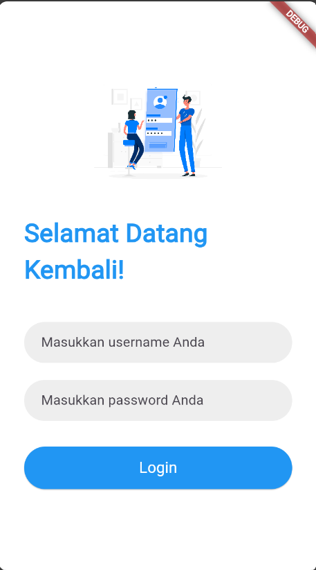
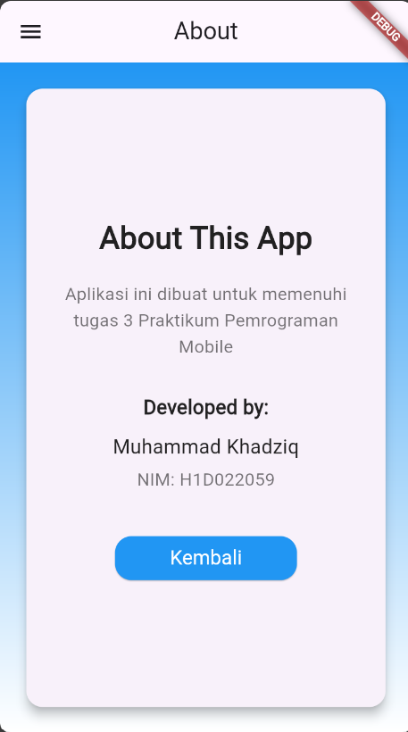
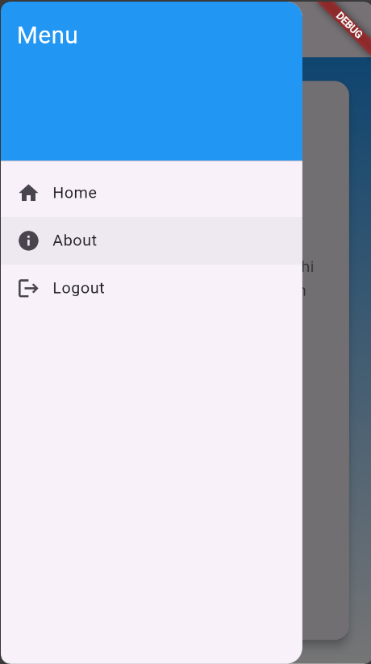

## 1. `loginpage.dart`

**LoginPage** bertanggung jawab untuk mengelola proses autentikasi pengguna. Ini adalah halaman pertama yang muncul ketika pengguna membuka aplikasi.

- **Fitur Utama**:
  - Pengguna harus memasukkan username dan password untuk mengakses aplikasi.
  - Username dan password yang benar adalah `admin/admin`.
  - Menggunakan **Shared Preferences** untuk menyimpan status login dan username.
  - Jika login berhasil, pengguna akan diarahkan ke halaman utama (home).
  - Jika gagal, pesan kesalahan akan ditampilkan.

- **Fungsi Penting**:
  - `_handleLogin()`: Menangani proses login dan verifikasi kredensial.
  - `_saveUsername()`: Menyimpan username pengguna menggunakan **Shared Preferences**.
  - `_setLoginStatus()`: Menyimpan status login pengguna.

- **Gambar**:
  - Menampilkan gambar (logo atau simbol) sebagai elemen visual di atas formulir login.

## 2. `homepage.dart`

**HomePage** adalah halaman utama yang dituju setelah pengguna berhasil login.

- **Fitur Utama**:
  - Menampilkan teks sambutan yang diambil dari **Shared Preferences**, menampilkan nama pengguna yang sedang login.
  - Halaman ini adalah pintu masuk utama untuk mengakses fitur lain dalam aplikasi.
  
- **Fungsi Penting**:
  - Penggunaan **Drawer** untuk navigasi ke halaman lain seperti `about` dan `sidebar`.
  - Menampilkan berbagai informasi yang relevan dengan aplikasi.

## 3. `aboutpage.dart`

**AboutPage** adalah halaman yang berisi informasi tentang aplikasi.

- **Fitur Utama**:
  - Menampilkan penjelasan singkat mengenai tujuan dari aplikasi ini.
  - Menampilkan informasi tentang pengembang (nama, NIM).
  - Memiliki tombol **Kembali** yang mengarahkan pengguna kembali ke **HomePage**.
  - Menggunakan **Card** untuk menampilkan informasi dalam bentuk kotak yang lebih terstruktur dan estetis.
  - Halaman ini juga dilengkapi dengan gradient background untuk mempercantik tampilan.

## 4. `sidemenu.dart`

**SideMenu** atau Drawer adalah elemen navigasi yang memungkinkan pengguna untuk berpindah antar halaman dengan mudah.

- **Fitur Utama**:
  - Berisi beberapa menu navigasi seperti **Home**, **About**, dan **Logout**.
  - Menu **Home**: Mengarahkan pengguna ke halaman utama (HomePage).
  - Menu **About**: Mengarahkan pengguna ke halaman about (AboutPage).
  - Menu **Logout**: Menghapus status login dan mengarahkan pengguna kembali ke halaman login (LoginPage).
  
- **Fungsi Penting**:
  - `Navigator.pushReplacement()`: Digunakan untuk memindahkan halaman tanpa memungkinkan pengguna kembali ke halaman sebelumnya dengan tombol back.

## 5. `main.dart`

**Main.dart** adalah file utama yang menginisialisasi aplikasi dan menentukan route ke halaman login sebagai entry point.

- **Fungsi Utama**:
  - Menentukan **LoginPage** sebagai halaman awal aplikasi.
  - Mengatur berbagai route dan navigasi utama dalam aplikasi.

## Screenshot Aplikasi

